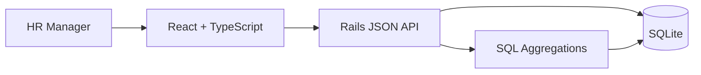
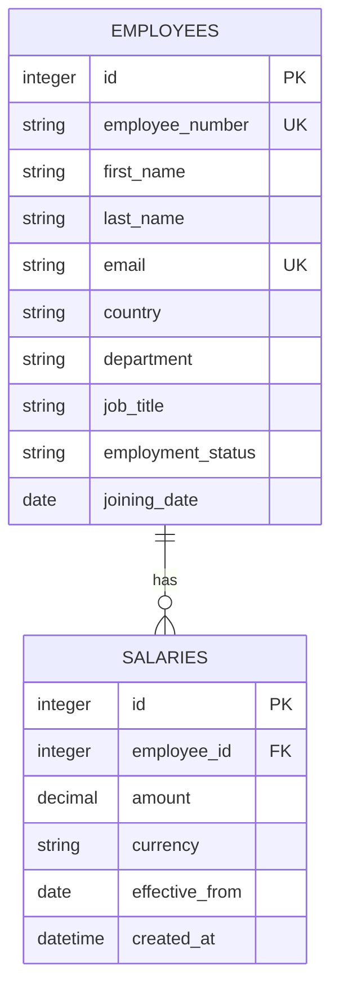

# Architecture

```mermaid
flowchart LR
 HR[HR Manager] --> UI[React + TypeScript]
 UI --> API[Rails JSON API]
 API --> DB[(SQLite)]
 API --> AGG[SQL Aggregations]
 AGG --> DB
```

## Data model

```mermaid
erDiagram
 EMPLOYEES ||--o{ SALARIES : has
 EMPLOYEES { integer id PK string employee_number UK string first_name string last_name string email UK string country string department string job_title string employment_status date joining_date }
 SALARIES { integer id PK integer employee_id FK decimal amount string currency date effective_from datetime created_at }
```

Salary records are append-oriented; a new salary does not overwrite history.
